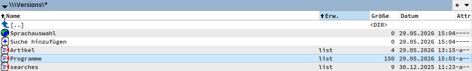
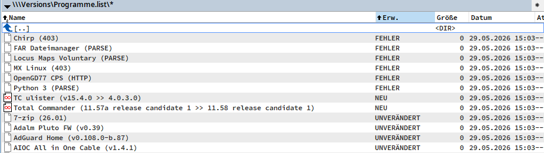

# Versions WFX Plugin (Total Commander)

`Versions` is a Total Commander file system plugin that checks program/version strings on web pages and shows the current status directly in TC.

This repository contains an updated FPC/Lazarus-compatible codebase with reliability, parsing, and UX improvements.






## Key Features

- Checks version entries from `.list` files.
- Supports HTTPS and modern HTTP behavior.
- Keeps list entry order in output.
- Shows localized status labels (`NEW`, `UNCHANGED`, `ERROR`, etc.) based on selected language file.
- Works with Unicode and 64-bit builds.

## Recently Added / Improved

- Parallel page fetching with configurable worker count.
  - New INI key: `MaxParallelRequests` (default `8`).
  - Results are processed and shown after all list entries are finished.
  - Return values are evaluated per entry.
- Configurable connection timeout.
  - New INI key: `ConnectTimeout` in milliseconds (default `5000`).
- Windows-native HTTPS stack.
  - HTTP transport now uses WinHTTP instead of OpenSSL sockets.
  - Removes OpenSSL runtime DLL dependency for HTTPS in this plugin.
- Optional request logging.
  - New INI keys: `RequestLog` and `RequestLogFile`.
  - Thread-safe logging with timestamp, URL, status, and error code.
- Better handling of `.list` files.
  - Empty lines are ignored.
  - Lines starting with `;` are treated as comments and ignored.
  - In the root view, `.list` file size shows the number of valid entries (non-empty, non-comment).
- Parser improvements for markers.
  - Marker matching works across line breaks.
  - Version text is extracted with original casing preserved.
  - Found version text is limited to `64` UTF-8 bytes.
- Progress display improvements.
  - Total Commander progress now includes current count and the entry name (first field in `.list`).
- Improved request robustness.
  - Firefox-like User-Agent and browser-like headers.
  - Retry handling for transient HTTP/IO errors.
- Localized error output.
  - Errors are shown with localized error extension (language-dependent), while keeping technical details in logs.

## `.list` Format

A standard entry uses six fields:

`Name|URL|StartMarker|LeftMarker|RightMarker|CurrentVersion`

A search-only entry uses three fields:

`Name|URL|Parameters`

Notes:

- Empty lines are ignored.
- Lines starting with `;` are comments.
- Marker text can span multiple lines in downloaded HTML source.
- 3-field entries are shown as `.SEARCH` (localized) and are not fetched for version parsing.

## Status And Error Codes

Result lines are shown like:

- `ProductName (value).NEW`
- `ProductName (value).UNCHANGED`
- `ProductName (CODE).ERROR` (localized extension text)

Meaning of common codes inside `(...)`:

- `403`, `404`, `429`, `500`, `502`, `503`, `504`, ...  
  Direct HTTP status code returned by the server.
- `PARSE`  
  The configured markers could not be found/matched in the fetched page.
- `EMPTY`  
  Request finished, but no response body was returned.
- `ABORT`  
  User canceled while progress dialog was active.
- `WIN12002`  
  WinHTTP timeout (`ERROR_WINHTTP_TIMEOUT`).
- `WIN12007`  
  Name resolution failed (`ERROR_WINHTTP_NAME_NOT_RESOLVED`).
- `WIN12029`  
  Cannot connect (`ERROR_WINHTTP_CANNOT_CONNECT`).
- `WIN12030`  
  Connection error (`ERROR_WINHTTP_CONNECTION_ERROR`).
- `WIN12032`  
  Request retry required by WinHTTP (`ERROR_WINHTTP_RESEND_REQUEST`).
- `WIN12005`  
  Invalid URL (`ERROR_WINHTTP_INVALID_URL`).
- `ERROR`  
  Generic fallback when no more specific code is available.

Notes:

- `HTTP`/`EHTTPClient` style errors are from older implementations; current builds use WinHTTP and show HTTP status codes or `WINxxxxx`.
- The extension after the code is localized (for example `.ERROR` in English, translated labels in other language files).
- If `RequestLog=1`, technical details are written to `RequestLogFile` with timestamp, URL, status, and error code.

## Configuration (`versions.ini`)

The plugin reads configuration from `versions.ini` in the plugin directory.

Supported keys:

- `Language`  
  Language file without extension, e.g. `ver_English`.
- `UseLowerCase`  
  `1`/`0`, default `1`. Controls case-insensitive marker search behavior.
- `DontValidateCertificate`  
  `1`/`0`, default `0`. Disables SSL certificate validation when enabled.
- `MaxParallelRequests`  
  Integer, default `8`. Number of parallel fetch workers.
- `ConnectTimeout`  
  Integer milliseconds, default `5000`. Connection timeout per request.
- `RequestLog`  
  `1`/`0`, default `0`. Enables request logging.
- `RequestLogFile`  
  Log filename/path, default `versions_http.log`.  
  Relative paths are resolved against plugin directory.

## Build

This project is configured for Free Pascal / Lazarus (`{$mode objfpc}`).

Example build command:

```powershell
lazbuild versions.lpi
```

Typical output binary:

- `Versions.wfx64`

## Original Credits

- Original plugin author: Fabio Chelly
- Later maintenance: ProgMan13

See `readme.txt` for original historical notes and legacy changelog.
